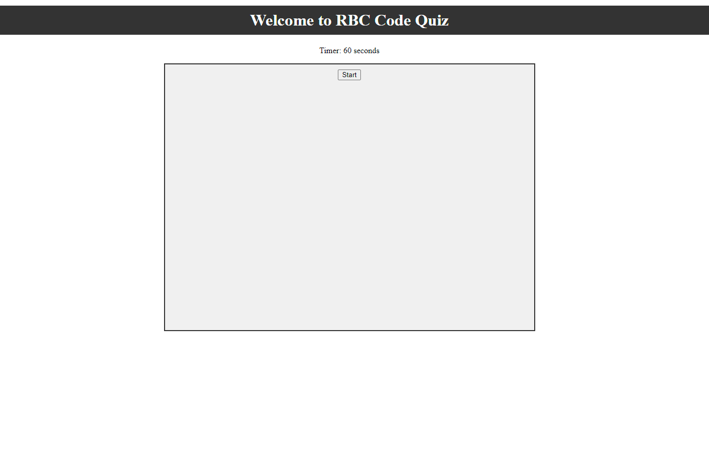

# rbc-code-quiz

## Description

This webpage was made to show my knowledge of JavaScript and the things I learned during the Rutgers Bootcamp. The quiz has basic questions on HTML, CSS, and JavaScript for those who are just getting into programming/coding.

## Installation

N/A

## Usage

Press start to begin the quiz the timer will start counting down and for every question answered incorrect  5 seconds will be deducted from the timer.

## Credits

N/A

## License

Please refer to the LICENSE in the repo.
